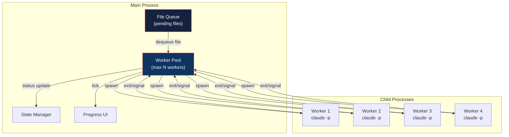
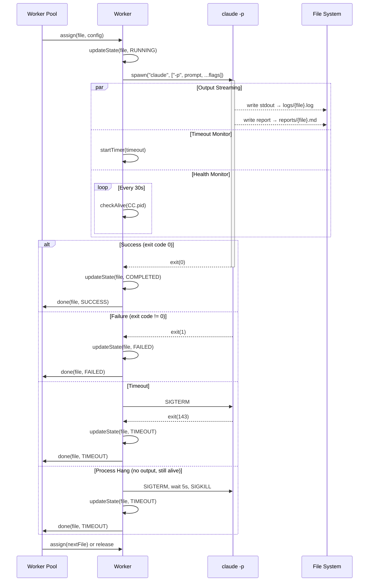
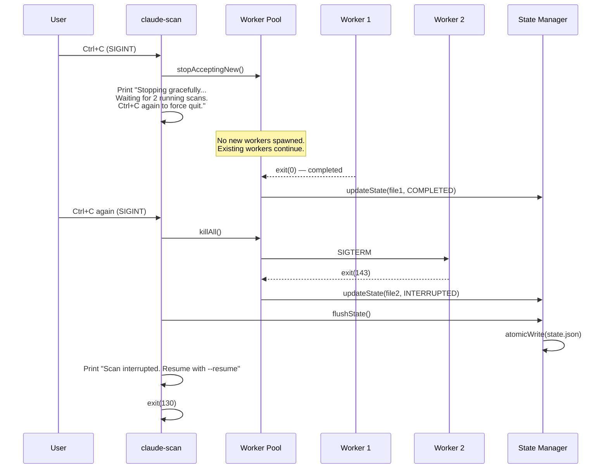
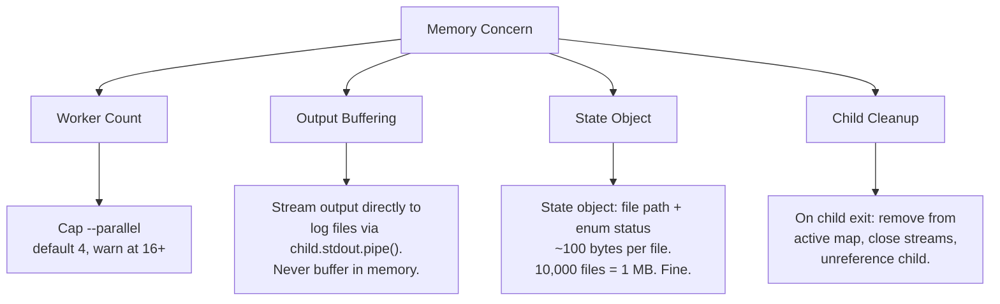
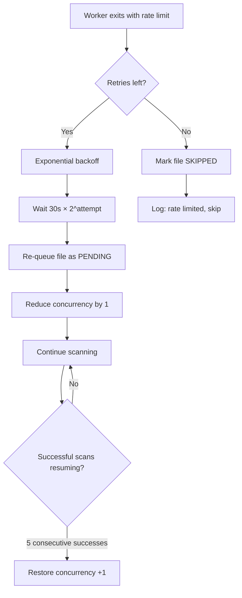

# Execution Engine: Worker Pool & Process Management

## Overview

The execution engine is the core of `claude-scan`. It manages a pool of workers, each
spawning a Claude Code child process for a single file. This document covers parallelism
strategy, process lifecycle, timeout handling, signal management, memory control, and
progress display.

---

## Why Not tmux?

The user's first instinct might be tmux — it manages multiple terminal sessions. But
`claude-scan` spawns **non-interactive** (`-p`) processes. tmux is wrong for this:

| Concern              | tmux                           | child_process.spawn            |
|----------------------|--------------------------------|--------------------------------|
| Interactive needed?  | Yes — tmux manages terminals   | No — `-p` mode is headless     |
| Dependency           | Must be installed separately   | Built into Node.js             |
| Process control      | Manual attach/detach           | Programmatic kill/signal       |
| Output capture       | Requires pane scraping         | Native stdout/stderr streams   |
| Concurrency control  | Manual session management      | Worker pool with queue         |
| Exit code access     | Requires scripting             | `child.exitCode` directly      |
| Cross-platform       | POSIX only                     | Works everywhere Node.js runs  |

**Verdict:** tmux adds a dependency, complexity, and no benefit. `child_process.spawn`
gives us everything we need natively.

---

## Worker Pool Architecture



### Pool Behavior

1. Pool starts empty, fills up to `--parallel` workers
2. Each worker dequeues the next PENDING file from the queue
3. Worker spawns `claude -p` as a child process
4. On child exit (success or failure), worker reports back to pool
5. Pool updates state, then assigns worker the next file
6. When queue is empty and all workers are idle, scan is complete

### Implementation Pattern

```
class WorkerPool {
  private active: Map<string, ChildProcess>  // filePath -> process
  private queue: string[]                     // pending file paths
  private concurrency: number                 // max parallel workers

  async start(): void
    while queue has items OR active has items:
      while active.size < concurrency AND queue has items:
        file = queue.shift()
        spawnWorker(file)
      await waitForAnyWorkerToFinish()

  spawnWorker(file: string): void
    process = spawn('claude', [...args])
    active.set(file, process)
    setupTimeout(file, process)
    setupOutputCapture(file, process)
    process.on('exit', (code) => handleExit(file, code))
}
```

---

## Process Lifecycle



---

## Parallel Execution Timeline

```mermaid
gantt
    title Parallel Scan — 10 Files, 4 Workers
    dateFormat HH:mm
    axisFormat %H:%M

    section Worker 1
    auth.ts           :a1, 00:00, 4min
    session.ts        :a2, after a1, 3min
    csrf.ts           :a3, after a2, 2min

    section Worker 2
    database.ts       :b1, 00:00, 6min
    queries.ts        :b2, after b1, 3min

    section Worker 3
    routes.ts         :c1, 00:00, 3min
    middleware.ts     :c2, after c1, 5min

    section Worker 4
    config.ts         :d1, 00:00, 2min
    handlers.ts       :d2, after d1, 4min
    utils.ts          :d3, after d2, 1min
```



Workers don't wait for each other. As soon as one finishes, it picks up the next
file from the queue. Faster files free up workers earlier, naturally load-balancing
across the pool.

---

## Concurrency Defaults and Limits

### Default: 4 workers

```
Workers = min(4, fileCount)
```

| Factor               | Constraint                                                  |
|----------------------|-------------------------------------------------------------|
| Memory per worker    | ~100-300 MB (Claude Code Node.js process)                   |
| 4 workers total      | ~0.5-1.2 GB — safe on most machines                         |
| API rate limits      | Anthropic rate limits are the real bottleneck, not CPU/RAM   |
| CPU                  | Minimal — workers are I/O bound (network API calls)         |
| Disk I/O             | Negligible — small report files                             |

### Guidance for users

```
Files < 10     →  --parallel 2    (avoid unnecessary overhead)
Files 10-100   →  --parallel 4    (default, good balance)
Files 100-500  →  --parallel 8    (if rate limits allow)
Files 500+     →  --parallel 8-16 (may need higher API tier)
```

Users can override with `--parallel N`. We cap at 32 with a warning:

```
⚠ Warning: --parallel 64 is very aggressive.
  Each worker spawns a claude process (~200MB RAM).
  64 workers ≈ 12.8 GB RAM. Use at your own risk.
```

---

## Timeout & Hang Detection

### Per-file timeout

Default: `300 seconds` (5 minutes). Most files analyze in 30-120 seconds.
Complex files (large, deep call chains) may need longer.

```
Timer starts when:  child process is spawned
Timer fires when:   no exit after --timeout seconds
Action:             SIGTERM → wait 5s → SIGKILL if still alive
```

### Hang detection (zombie process)

A process might be alive but stuck (e.g., Claude infinite-looping on tool calls,
network timeout inside Claude Code itself).

```
Hang detection:
  - Track last stdout/stderr activity timestamp
  - If no output for 120 seconds AND process is alive → consider hung
  - Send SIGTERM, wait 5s, SIGKILL
```

This catches cases where the timeout hasn't fired yet but the process is clearly stuck.

### Interaction with `--max-turns`

`--max-turns 30` (passed to Claude Code) provides a **second safety net**. Even if our
timeout hasn't fired, Claude will stop after 30 tool-use rounds. This prevents
runaway API costs on a single file.

---

## Signal Handling

### Ctrl+C: Graceful Shutdown



### Signal Matrix

| Signal  | Source              | Behavior                                            |
|---------|---------------------|-----------------------------------------------------|
| SIGINT  | Ctrl+C (1st)        | Stop queue drain, wait for running workers          |
| SIGINT  | Ctrl+C (2nd)        | Kill all workers, save state, exit                  |
| SIGTERM | `kill <pid>`        | Same as 1st Ctrl+C — graceful shutdown              |
| SIGKILL | `kill -9 <pid>`     | Untrappable — process dies. State on disk is valid  |
| SIGHUP  | Terminal closed     | Same as SIGTERM — graceful shutdown                 |

### Propagation to children

When we receive SIGTERM/SIGINT, we forward SIGTERM to all child processes.
We do NOT forward SIGKILL — the OS handles that.

```typescript
process.on('SIGINT', () => {
  if (shuttingDown) {
    // Second Ctrl+C — force kill
    for (const [file, child] of pool.active) {
      child.kill('SIGTERM');
      setTimeout(() => child.kill('SIGKILL'), 5000);
    }
    state.flush();
    process.exit(130);
  }
  shuttingDown = true;
  pool.stopAcceptingNew();
  // ... wait for active workers
});
```

---

## Memory Management

### Problem

Each `claude` child process is a full Node.js application (~100-300 MB RSS).
With `--parallel 8`, that's ~1-2.4 GB just for the children, plus our orchestrator.

### Strategy



### Key rules

1. **Never buffer child stdout/stderr in memory.** Pipe directly to file write streams.
2. **Close write streams on child exit.** Prevents file descriptor leaks.
3. **Remove child references on exit.** Let GC collect the ChildProcess objects.
4. **Don't accumulate report contents.** Read reports from disk only during final aggregation.
5. **Periodic GC hint** (optional): `global.gc()` every 100 files if `--expose-gc` is set.

### Memory leak prevention checklist

```
[ ] child.stdout.pipe(fileStream) — not child.stdout.on('data', buffer += data)
[ ] fileStream.end() called on child exit
[ ] child removed from active Map on exit
[ ] Error event handlers on child — prevents unhandled errors from leaking
[ ] child.unref() after we're tracking it ourselves (prevents Node.js exit hang)
[ ] No growing arrays — queue shrinks as files are processed
[ ] State writes are snapshots, not appends
```

---

## Rate Limiting & Backoff

Anthropic enforces API rate limits. When Claude Code hits a rate limit, it either:
- Retries internally (newer versions handle this), or
- Exits with an error

### Detection

```
Rate limit indicators in claude output:
  - Exit code != 0
  - stderr contains "rate_limit" or "429" or "overloaded"
  - stderr contains "ResourceExhausted"
```

### Response



### Adaptive concurrency

```
On rate limit:
  concurrency = max(1, concurrency - 1)

After 5 consecutive successes:
  concurrency = min(originalConcurrency, concurrency + 1)
```

This automatically throttles down when hitting limits and recovers when the
window reopens.

---

## Progress Display

### Terminal UI (interactive mode)

```
claude-scan v1.0.0 — Scanning my-project (247 files)

  Progress: [████████████░░░░░░░░░░░░░░░░░] 98/247 (39.7%)

  Worker 1: ● scanning src/auth/session.ts      (1m 23s)
  Worker 2: ● scanning src/db/migrations.py     (0m 45s)
  Worker 3: ● scanning src/api/handlers.go      (2m 01s)
  Worker 4: ◌ idle

  Completed: 94 | Failed: 3 | Timeout: 1 | Remaining: 149
  Findings:  12 critical | 23 high | 8 medium | 41 low
  Elapsed:   14m 32s | Est. remaining: ~22m
```

### Non-interactive mode (piped output, CI)

When stdout is not a TTY (piped, CI), use simple log lines:

```
[14:23:01] START   src/auth/session.ts (worker 1)
[14:23:45] DONE    src/auth/login.ts — 2 findings (44s)
[14:24:12] TIMEOUT src/legacy/compat.c — exceeded 300s
[14:24:12] START   src/api/handlers.go (worker 3)
...
[14:45:33] SUMMARY 247 files | 94 completed | 3 failed | 84 findings
```

### Implementation

```typescript
// Detect terminal capability
const isTTY = process.stdout.isTTY;

if (isTTY) {
  // Use ANSI escape codes for in-place updates
  // Redraw progress block every 500ms
  setInterval(() => renderProgress(), 500);
} else {
  // Simple line-by-line logging
  pool.on('start', (file) => console.log(`[${time()}] START ${file}`));
  pool.on('done',  (file, result) => console.log(`[${time()}] DONE  ${file} — ${result}`));
}
```

---

## Edge Cases in Execution

### Claude Code crashes immediately (bad install, missing dependency)

**Detection:** Exit code within 2 seconds of spawn.
**Response:** After 3 rapid crashes, halt the scan:

```
Error: Claude Code is crashing on startup.
  Last 3 workers exited within 2s.
  Check: claude --version, claude auth status
```

### Claude Code hangs on startup (network issue, slow auth)

**Detection:** No output after 60 seconds.
**Response:** Kill process, mark TIMEOUT, continue with next file.

### Disk full during report write

**Detection:** `ENOSPC` error from write stream.
**Response:** Flush state (state.json is small), halt scan with error:

```
Error: Disk full. Flushed state for resume.
  Free space and run: claude-scan --resume
```

### Target repo changes during scan

Not a concern. Each Claude Code process reads files at spawn time.
We are not modifying the target repo. If the user modifies files
concurrently, individual scan results may be inconsistent, but
no corruption occurs.

### Two simultaneous scans on same repo

Prevented by `scan.lock`:

```typescript
// On start
if (existsSync('.claude-scan/scan.lock')) {
  const lock = JSON.parse(readFileSync('.claude-scan/scan.lock'));
  const age = Date.now() - lock.startedAt;
  if (age < MAX_SCAN_DURATION) {
    error('Another scan is running. Use --force to override.');
  } else {
    warn('Stale lock detected (previous scan may have crashed). Overriding.');
  }
}
writeFileSync('.claude-scan/scan.lock', JSON.stringify({
  pid: process.pid,
  startedAt: Date.now()
}));

// On exit (success, error, or signal)
unlinkSync('.claude-scan/scan.lock');
```
