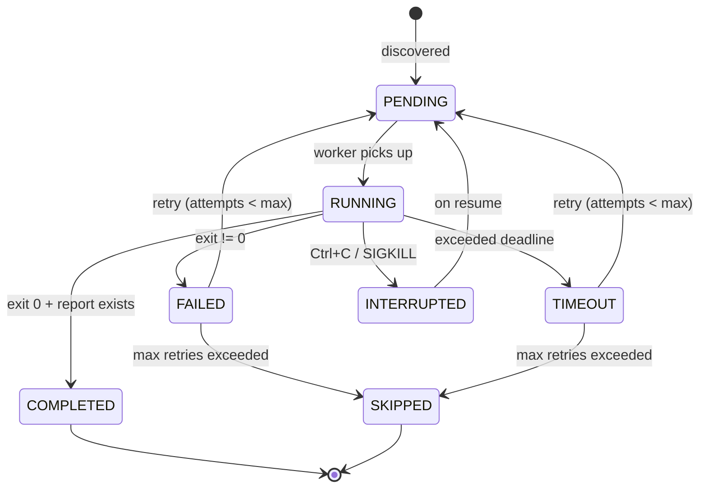
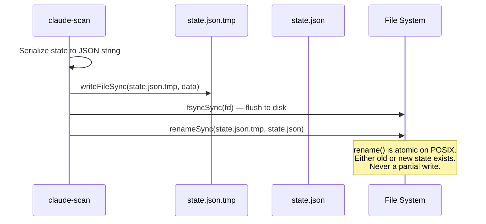
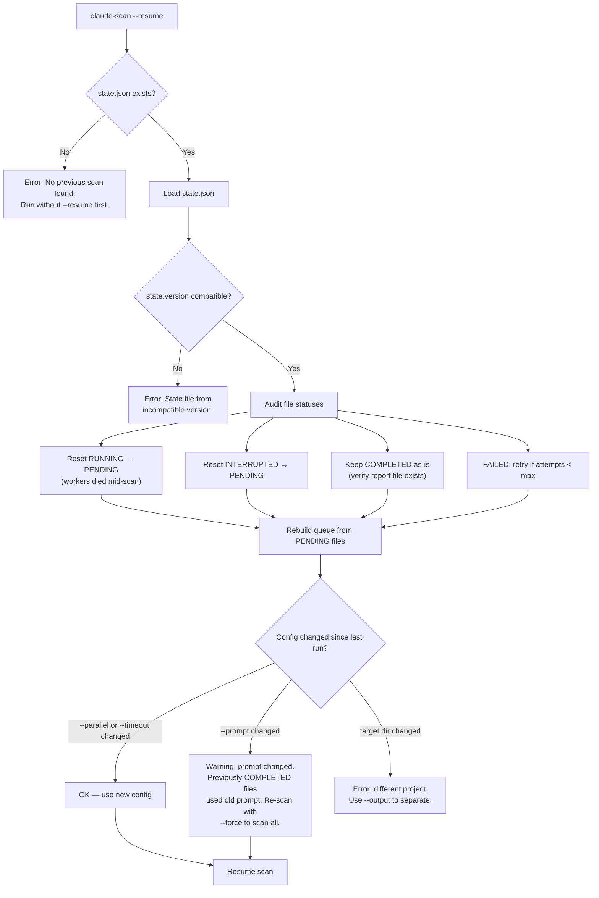
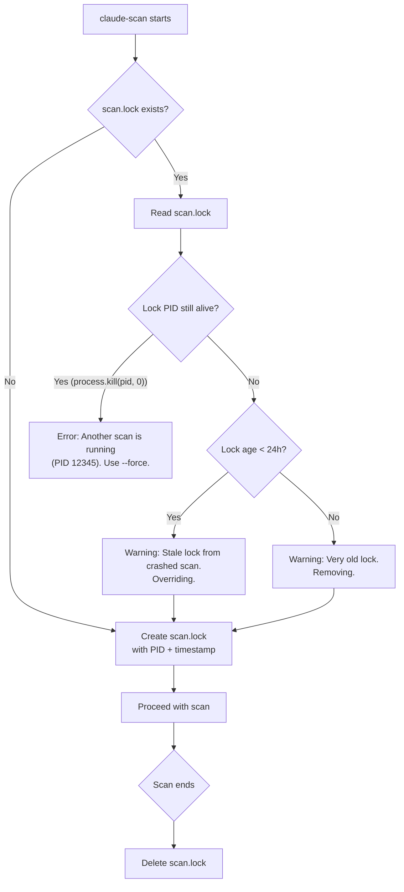
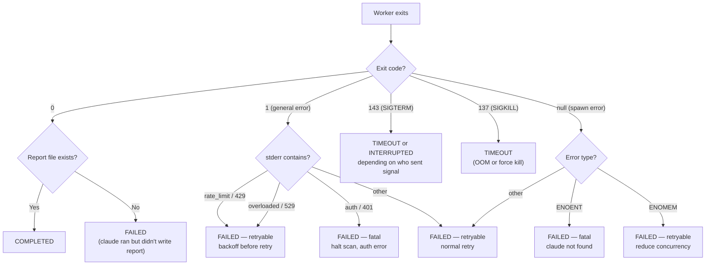
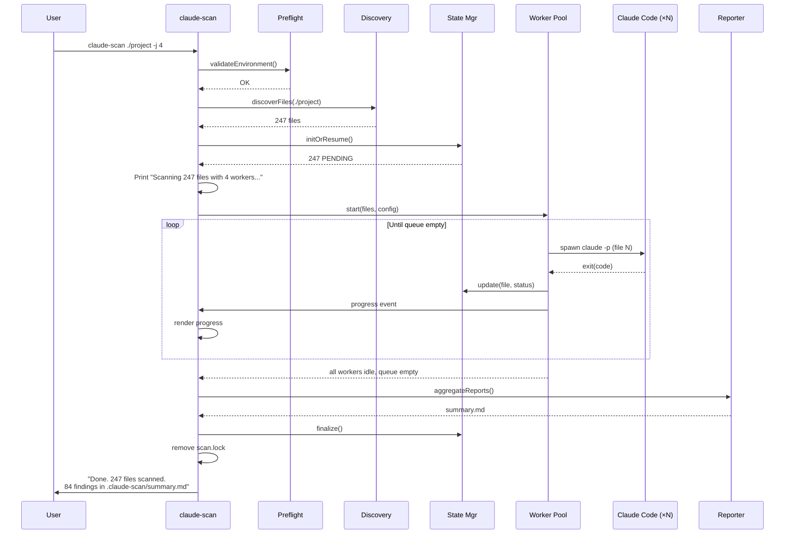

# Resilience & Recovery: State, Crash Safety, and Resume

## Overview

A scan of a large codebase may run for hours across hundreds of files. The system
must survive crashes, interruptions, and partial failures without losing completed
work or corrupting state. This document covers the state machine, persistence
strategy, crash recovery, resume logic, and the complete edge case matrix.

---

## File Scan State Machine

Every file in the scan has a status that follows this state machine:



### State Definitions

| Status        | Meaning                                           | On Resume           |
|---------------|---------------------------------------------------|---------------------|
| `PENDING`     | Not yet scanned                                   | Scan it             |
| `RUNNING`     | Currently being scanned by a worker               | Reset to PENDING    |
| `COMPLETED`   | Successfully scanned, report written              | Skip                |
| `FAILED`      | Claude exited with error (non-zero, no report)    | Retry or skip       |
| `TIMEOUT`     | Exceeded per-file timeout, killed                 | Retry or skip       |
| `INTERRUPTED` | Scan stopped by user signal mid-scan              | Reset to PENDING    |
| `SKIPPED`     | Exceeded max retries, or filtered out             | Skip                |

---

## State File Format

```json
{
  "version": 1,
  "scanId": "a1b2c3d4",
  "targetDir": "/path/to/project",
  "startedAt": "2026-04-11T10:30:00Z",
  "config": {
    "parallel": 4,
    "timeout": 300,
    "maxRetries": 2,
    "maxTurns": 30,
    "model": null,
    "prompt": "default"
  },
  "stats": {
    "totalFiles": 247,
    "completed": 142,
    "failed": 3,
    "timeout": 1,
    "skipped": 2,
    "pending": 99,
    "running": 0
  },
  "files": {
    "src/auth/login.ts": {
      "status": "COMPLETED",
      "attempts": 1,
      "startedAt": "2026-04-11T10:30:05Z",
      "completedAt": "2026-04-11T10:31:42Z",
      "durationMs": 97000,
      "reportPath": "reports/src__auth__login.ts.md",
      "findings": 2,
      "exitCode": 0
    },
    "src/db/queries.py": {
      "status": "FAILED",
      "attempts": 2,
      "startedAt": "2026-04-11T10:35:12Z",
      "completedAt": "2026-04-11T10:36:01Z",
      "durationMs": 49000,
      "reportPath": null,
      "findings": 0,
      "exitCode": 1,
      "lastError": "rate_limit_exceeded"
    },
    "src/api/handler.go": {
      "status": "PENDING",
      "attempts": 0
    }
  }
}
```

### Why JSON, not SQLite?

| Criterion        | JSON                          | SQLite                         |
|------------------|-------------------------------|--------------------------------|
| Simplicity       | Read/write with stdlib        | Requires `better-sqlite3`      |
| Human readable   | Yes — inspect with any editor | No — need sqlite3 CLI          |
| Atomic write     | Temp file + rename            | Built-in transactions          |
| Concurrent write | Single writer (our process)   | Supports multiple              |
| File count limit | ~10k files before slow parse  | Millions                       |

For most projects (< 10k files), JSON is sufficient. If we ever need to support
monorepos with 100k+ files, we can migrate to SQLite.

---

## Atomic State Writes

State corruption is the worst failure mode — it could lose track of completed work.
We prevent this with atomic writes:



### Implementation

```typescript
function saveState(state: ScanState): void {
  const tmpPath = state.path + '.tmp';
  const data = JSON.stringify(state, null, 2);

  // Write to temp file
  const fd = fs.openSync(tmpPath, 'w');
  fs.writeSync(fd, data);
  fs.fsyncSync(fd);  // Force flush to disk
  fs.closeSync(fd);

  // Atomic rename
  fs.renameSync(tmpPath, state.path);
}
```

### When do we save state?

```
Events that trigger state save:
  ✓ File status changes (PENDING → RUNNING, RUNNING → COMPLETED, etc.)
  ✓ Every 30 seconds (periodic checkpoint)
  ✓ On SIGINT / SIGTERM (before exit)
  ✓ On scan completion

Debounce: if multiple status changes happen within 500ms, batch into one write.
This prevents excessive disk I/O with many parallel workers.
```

---

## Crash Recovery Flow



### What gets verified on resume

```
For each COMPLETED file:
  1. Does the report file still exist?
     → If not, reset to PENDING (report was deleted/lost)
  2. Does the source file still exist?
     → If not, mark SKIPPED (file was removed from project)
  3. Has the source file changed? (mtime comparison)
     → If yes, optionally re-scan (with --rescan-modified flag)
```

---

## Crash Scenarios Matrix

| Crash Type                   | State at Crash Time                   | Recovery                                          |
|------------------------------|---------------------------------------|---------------------------------------------------|
| `kill -9` (SIGKILL)         | state.json from last checkpoint       | RUNNING files reset to PENDING. Max 30s of lost progress (checkpoint interval). |
| Power loss                   | state.json fsynced to disk            | Same as SIGKILL. Atomic rename ensures no partial state file. |
| OOM killer                   | State in memory, not yet flushed      | Same as SIGKILL. Periodic checkpoints limit loss.  |
| Node.js crash (uncaught err) | process.on('exit') fires              | State saved in exit handler. Very little loss.     |
| Ctrl+C (SIGINT)              | Graceful shutdown                     | All running workers complete or are killed. State saved. |
| Disk full                    | state.json.tmp write fails            | Previous state.json is untouched (rename never happened). |
| Claude Code hangs            | Our process is fine                   | Timeout kills the hung child. Scan continues.      |
| Network drops                | Claude Code handles internally        | Claude retries or exits with error. We mark FAILED and retry. |
| API key revoked              | All workers fail immediately          | Detect: 3+ rapid failures in a row. Halt with auth error. |

---

## Lock File Protocol

Prevents two `claude-scan` instances from colliding on the same output directory.



### Lock file format

```json
{
  "pid": 12345,
  "startedAt": "2026-04-11T10:30:00Z",
  "hostname": "dev-machine",
  "version": "1.0.0"
}
```

---

## Duplicate Scan Prevention

### Do we need file-level locks?

**No.** Here's why:

1. **Source files are read-only.** Claude reads them but doesn't modify them.
   Multiple Claude instances could read the same file safely.

2. **But we don't want to scan the same file twice.** The queue ensures each
   file is assigned to exactly one worker. The state manager is the single
   source of truth.

3. **Report files are unique per source file.** `reports/src__auth__login.ts.md`
   is written by exactly one worker. No contention.

4. **State updates go through a single process.** Our Node.js orchestrator
   is single-threaded. State mutations are serialized naturally.

```
Concurrency model:

  Main process (single-threaded):
    ├── Owns the queue (array)
    ├── Owns the state (object)
    ├── Owns the lock file
    └── Spawns child processes

  Child processes (N parallel):
    ├── Read source files (read-only, no conflict)
    ├── Write to unique report files (no conflict)
    └── Write to unique log files (no conflict)

  → No file-level locks needed. No mutexes. No semaphores.
    Single-threaded orchestrator + unique output paths = safe.
```

---

## Error Classification & Retry Strategy



### Retry policy

```
retry(file):
  if file.attempts >= maxRetries:
    file.status = SKIPPED
    return

  file.attempts += 1
  file.status = PENDING  // re-queued

  // Delay based on failure type
  if file.lastError == 'rate_limit':
    delay = 30s * 2^(file.attempts - 1)  // exponential backoff
  else:
    delay = 5s  // brief pause before retry
```

### Fatal vs retryable errors

| Error Type               | Retryable? | Action                           |
|--------------------------|------------|----------------------------------|
| Rate limit (429)         | Yes        | Backoff + reduce concurrency     |
| Server overloaded (529)  | Yes        | Backoff                          |
| Auth failure (401)       | No         | Halt entire scan                 |
| Claude not found         | No         | Halt entire scan                 |
| Out of memory            | Yes        | Reduce concurrency, retry        |
| General error            | Yes        | Simple retry                     |
| Timeout                  | Yes        | Retry (with same timeout)        |
| Disk full                | No         | Halt, flush state                |

---

## Data Integrity Guarantees

### What we guarantee

```
1. COMPLETED files are never re-scanned (unless --force or --rescan-modified)
2. Every report file on disk corresponds to a COMPLETED entry in state
3. state.json is never partially written (atomic rename)
4. Crash at any point → resume recovers all completed work
5. No duplicate scans — each file scanned at most once per run
6. No orphan processes — all children tracked and killed on exit
```

### What we don't guarantee

```
1. Report quality — Claude may produce false positives or miss bugs
2. Determinism — same file may get different findings on re-scan
3. Real-time state — up to 30s of progress may be lost on SIGKILL
4. Source file consistency — if user modifies files during scan,
   individual reports may reflect different file versions
```

---

## Full Lifecycle: End to End



---

## Appendix: State File Migration

When `claude-scan` is updated, the state file format may change. We version the format:

```typescript
const STATE_VERSION = 1;

function loadState(path: string): ScanState {
  const raw = JSON.parse(readFileSync(path));

  if (raw.version > STATE_VERSION) {
    throw new Error('State file is from a newer version. Update claude-scan.');
  }

  if (raw.version < STATE_VERSION) {
    return migrateState(raw); // Apply migrations
  }

  return raw;
}
```

Migrations are forward-only and additive (new fields with defaults). We never
remove fields — old versions can still read newer state files by ignoring
unknown fields.
