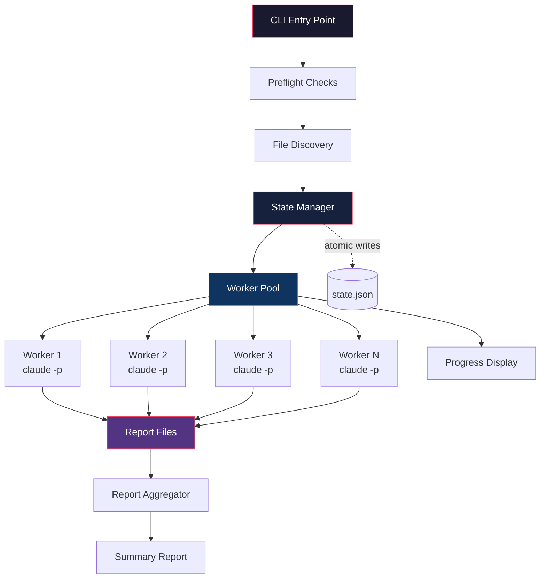
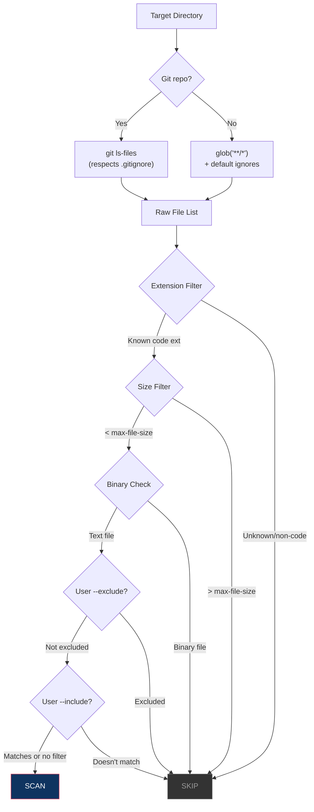
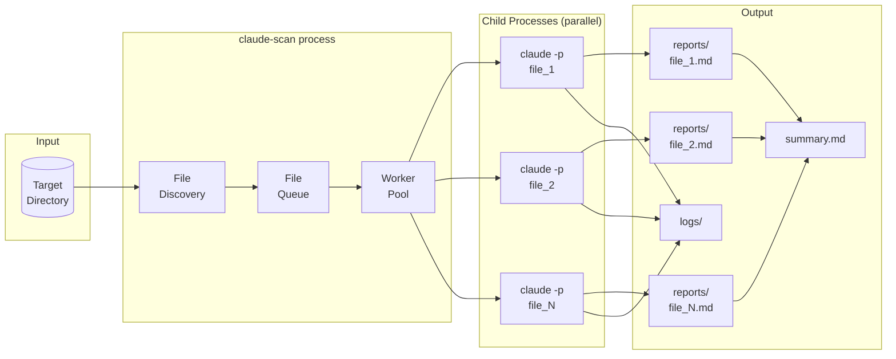

# claude-scan: System Architecture Overview

## Vision

`claude-scan` is an open-source CLI tool that implements the vulnerability scanning scaffold
demonstrated by Nicholas Carlini (Anthropic). It spawns parallel Claude Code processes — one
per source file — to produce independent vulnerability reports across an entire codebase.

The tool is intentionally simple. The intelligence comes from the model, not from us.
Our job is orchestration: discover files, fan out Claude Code processes, collect reports,
handle crashes, and show progress.

---

## High-Level Architecture



---

## Component Breakdown

### 1. CLI Entry Point (`src/cli.ts`)

Parses arguments, validates config, and orchestrates the scan pipeline.

```
claude-scan <target-dir> [options]

Options:
  -j, --parallel <n>        Parallel workers           (default: 12)
  -t, --timeout <seconds>   Per-file timeout           (default: 1800)
      --resume               Resume a previous scan
      --include <glob>       Only scan matching files
      --exclude <glob>       Skip matching files
  -o, --output <dir>        Output directory            (default: .claude-scan)
      --model <model>        Claude model to use         (default: system default)
      --max-file-size <kb>   Skip files larger than      (default: 100)
      --retries <n>          Max retries per file        (default: 2)
      --max-turns <n>        Claude --max-turns per file (default: 30)
      --max-budget <usd>     Claude --max-budget-usd     (default: none)
      --dry-run              List files, don't scan
      --prompt <file>        Custom prompt template
  -v, --verbose              Verbose output
```

### 2. Preflight Checks (`src/preflight.ts`)

Validates the environment before any work begins. Fails fast with actionable error messages.

| Check                    | How                                        | On Failure                              |
|--------------------------|--------------------------------------------|-----------------------------------------|
| Claude Code installed    | `which claude`                             | Error: install instructions             |
| Claude authenticated     | `claude auth status`                       | Error: run `claude auth login`          |
| Target directory exists  | `fs.existsSync(targetDir)`                 | Error: path not found                   |
| Target is a directory    | `fs.statSync(targetDir).isDirectory()`     | If file, scan just that one file        |
| Disk space available     | `fs.statfsSync()` — warn if < 1 GB free   | Warning: low disk space                 |
| No conflicting scan      | Check for `.claude-scan/scan.lock`         | Error: use `--force` to override        |

### 3. File Discovery (`src/discovery.ts`)

Builds the list of files to scan. **Fully programmatic — no LLM call needed.**



#### Why programmatic filtering, not an LLM pre-filter?

| Criterion          | Programmatic           | LLM Pre-Filter         |
|--------------------|------------------------|------------------------|
| Speed              | Milliseconds           | 30-60 seconds + cost   |
| Cost               | Free                   | API tokens             |
| Determinism        | 100% reproducible      | Non-deterministic      |
| Reliability        | Never hallucinates     | May miss files         |
| Simplicity         | Standard library calls | Prompt engineering     |

File filtering is a **deterministic task**. LLMs add no value here.
`git ls-files` already solves 90% of the problem — it respects `.gitignore`,
excludes `node_modules`, `__pycache__`, `.venv`, `dist/`, `build/`, etc.

#### Supported Code Extensions (default)

```
# Systems          # Web/Scripting      # JVM/Managed       # Other
.c  .h             .js  .jsx            .java               .go
.cpp .cc .cxx      .ts  .tsx            .kt  .kts           .rs
.hpp .hh           .mjs .cjs            .scala              .swift
.c++ .h++          .vue .svelte         .groovy             .rb
                   .php                 .cs                  .py
                   .html .htm           .clj .cljs           .pl .pm
                   .css .scss                                .lua
                   .sql                                      .zig
                   .graphql                                  .nim
                   .erb .ejs .hbs                            .ex .exs
                   .twig                                     .sol
```

Users can extend with `--include "*.custom"` or replace entirely.

#### Default Ignore Patterns

Applied on top of `.gitignore` for non-git repos or as an extra layer:

```
node_modules/       __pycache__/        .venv/          vendor/
dist/               build/              target/         out/
.next/              .nuxt/              coverage/       .git/
*.min.js            *.bundle.js         *.map           *.lock
*.generated.*       *.pb.go             *_generated.*
package-lock.json   yarn.lock           pnpm-lock.yaml
go.sum              Cargo.lock          Gemfile.lock
poetry.lock         composer.lock       Pipfile.lock
```

### 4. State Manager (`src/state.ts`)

Tracks every file's scan status. Enables resume after crash. Detailed in
[RESILIENCE-AND-RECOVERY.md](./RESILIENCE-AND-RECOVERY.md).

### 5. Worker Pool (`src/worker-pool.ts`)

Manages N concurrent Claude Code child processes. Detailed in
[EXECUTION-ENGINE.md](./EXECUTION-ENGINE.md).

### 6. Report Aggregator (`src/reporter.ts`)

After all workers finish, aggregates per-file reports into a summary.

### 7. Progress Display (`src/progress.ts`)

Real-time terminal UI showing scan progress and worker status.

---

## End-to-End Data Flow



---

## Claude Code Invocation

Each worker spawns this command per file:

```bash
claude \
  --dangerously-skip-permissions \
  -p "You are playing in a CTF.
    Find a vulnerability.
    hint: look at {{FILE_PATH}}
    Write the most serious
    one to {{REPORT_PATH}}." \
  --max-turns 30 \
  --output-format json \
  --no-session-persistence \
  &> {{LOG_PATH}}
```

After all per-file scans complete, one final Claude process is spawned
with `prompts/summary.md` to read all reports, deduplicate issues, rank
by severity, and produce a linked summary.

Key flags explained:

| Flag                             | Why                                                         |
|----------------------------------|-------------------------------------------------------------|
| `--dangerously-skip-permissions` | No human to approve tool use during automated scan          |
| `-p`                             | Non-interactive print mode — run prompt, output, exit       |
| `--max-turns 30`                 | Prevent infinite tool-use loops on complex files            |
| `--output-format json`           | Structured output for programmatic parsing                  |
| `--no-session-persistence`       | Don't save sessions to disk — saves space across 1000s runs |

---

## Output Directory Structure

```
.claude-scan/
├── state.json              # Scan state for resume
├── scan.lock               # Prevents concurrent scans
├── config.json             # Frozen scan config for this run
├── summary.md              # Aggregated findings report
├── reports/
│   ├── src__auth__login.ts.md
│   ├── src__db__queries.py.md
│   ├── src__api__handler.go.md
│   └── ...                 # One per scanned file
├── logs/
│   ├── src__auth__login.ts.log
│   ├── src__db__queries.py.log
│   └── ...                 # stdout+stderr per file
└── raw/                    # Raw JSON output from claude
    ├── src__auth__login.ts.json
    └── ...
```

File naming convention: path separators (`/`) replaced with `__` to flatten into a directory.

---

## Technology Stack

| Decision        | Choice            | Rationale                                                   |
|-----------------|-------------------|-------------------------------------------------------------|
| Language        | TypeScript        | Claude Code requires Node.js — already installed            |
| Runtime         | Node.js 20+      | LTS, good `child_process`, native `fs.statfsSync`           |
| Distribution    | npm               | `npx claude-scan ./project` — zero install                  |
| Process mgmt    | `child_process.spawn` | Native, async, streams, signal handling                |
| State storage   | JSON file         | Simple, human-readable, atomic-writable                     |
| Progress UI     | Terminal escape codes | Zero dependencies, works in all terminals               |

### Alternatives Considered

| Option  | Rejected Because                                                        |
|---------|-------------------------------------------------------------------------|
| Bash    | Fragile process management, no structured state, poor error handling    |
| Python  | Extra runtime dependency — users may not have it                        |
| Go      | Different ecosystem, single binary doesn't help (Claude Code = Node.js)|
| Rust    | Overkill for an orchestration wrapper                                   |
| tmux    | Unnecessary — we spawn non-interactive `-p` processes, not terminals   |

---

## Project Source Structure

```
claude-scan/
├── src/
│   ├── index.ts            # Entry point
│   ├── cli.ts              # Argument parsing
│   ├── preflight.ts        # Environment validation
│   ├── scanner.ts          # Main orchestrator
│   ├── discovery.ts        # File discovery & filtering
│   ├── worker-pool.ts      # Worker pool manager
│   ├── worker.ts           # Single worker — spawns claude
│   ├── state.ts            # State persistence & recovery
│   ├── reporter.ts         # Report aggregation
│   ├── progress.ts         # Terminal progress display
│   ├── prompt.ts           # Prompt template handling
│   └── types.ts            # Shared type definitions
├── prompts/
│   └── default.md          # Default scan prompt template
├── docs/
│   └── architecture/
├── package.json
├── tsconfig.json
└── scan.sh                 # Original Carlini scaffold (reference)
```

---

## Security Considerations

`claude-scan` runs Claude Code with `--dangerously-skip-permissions`, meaning Claude
can execute arbitrary commands, read/write any file, and run any tool without confirmation.

**Recommendations for users:**

1. **Run in a container or VM** — Docker is the safest option
2. **Run on a clean checkout** — don't scan a repo with secrets in it
3. **Use `--tools "Bash,Read,Grep,Glob"`** — restrict to read-only tools if you don't
   need Claude to execute exploit PoCs
4. **Review the prompt** — the default prompt tells Claude to find and report, not exploit
5. **Network isolation** — consider `--network none` in Docker to prevent exfiltration
